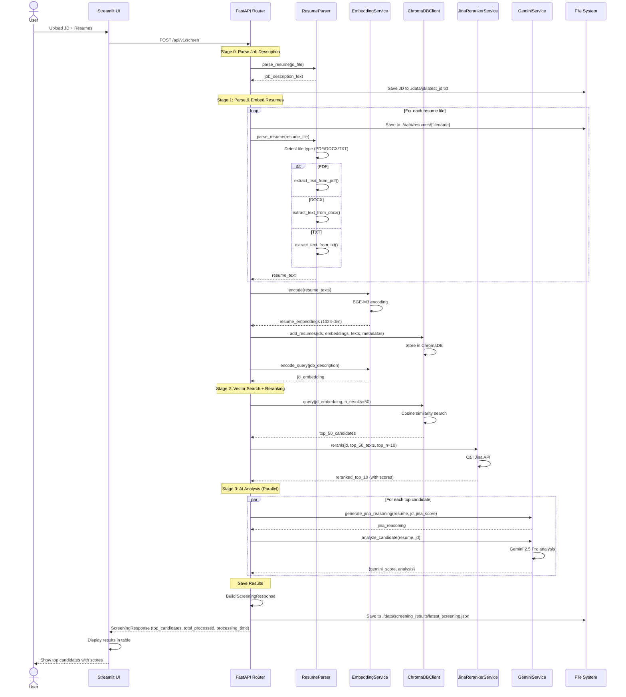
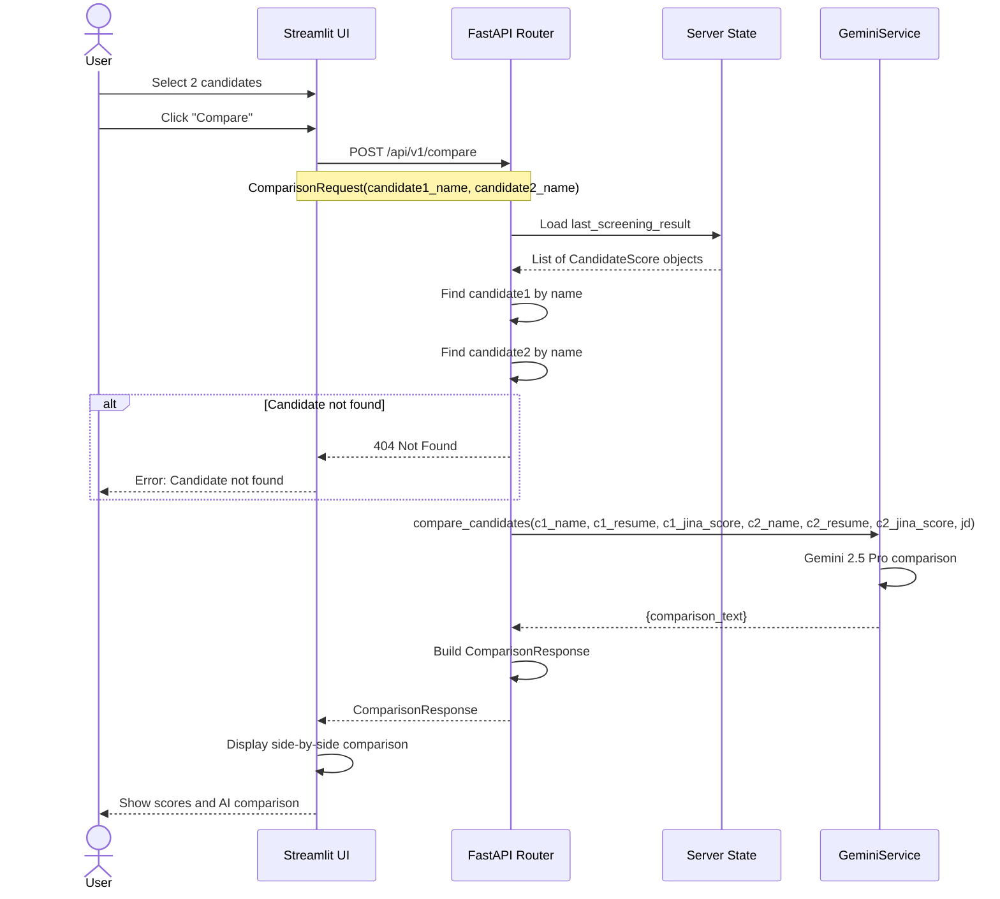
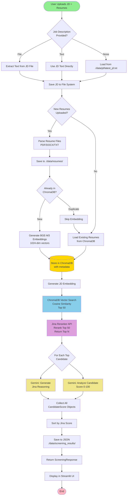
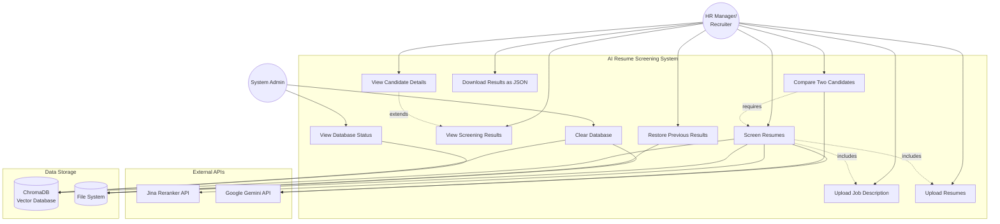
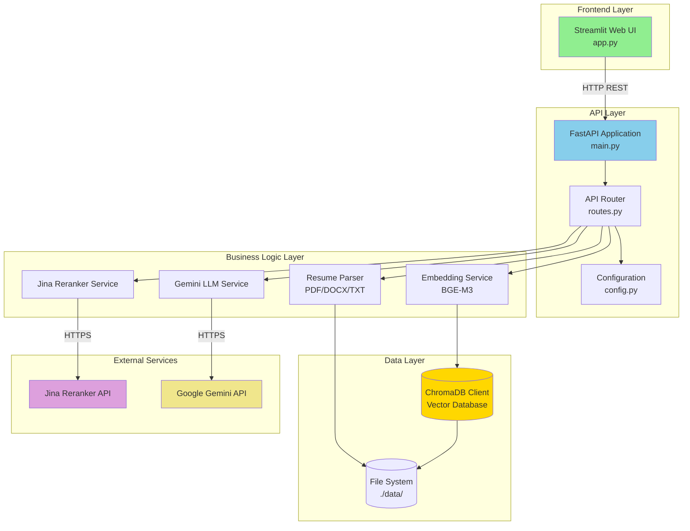
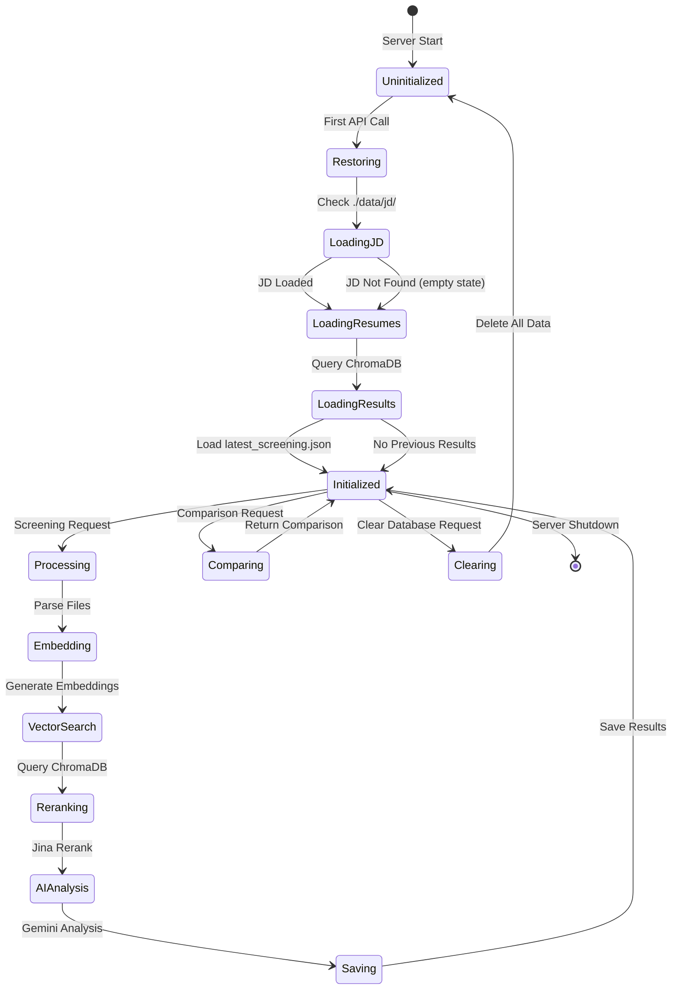

# AI Resume Screening System - UML Diagrams

## 1. Class Diagram

```mermaid
classDiagram
    %% Core Services
    class EmbeddingService {
        -SentenceTransformer model
        +__init__(model_name: str)
        +encode(texts: list~str~) np.ndarray
        +encode_query(query: str) np.ndarray
    }

    class ResumeParser {
        <<static>>
        +extract_text_from_pdf(file_path: str) str
        +extract_text_from_docx(file_path: str) str
        +extract_text_from_txt(file_path: str) str
        +parse_resume(file_path: str) Optional~str~
    }

    class JinaRerankerService {
        -str api_key
        -str base_url
        +__init__(api_key: str)
        +rerank(query: str, documents: list~str~, top_n: int) list~dict~
    }

    class GeminiService {
        -genai.Client client
        -str model_id
        +__init__(api_key: str)
        +generate_jina_reasoning(resume_text: str, job_description: str, jina_score: float) str
        +analyze_candidate(resume_text: str, job_description: str) dict
        +compare_candidates(candidate1_name: str, candidate1_resume: str, candidate1_jina_score: float, candidate2_name: str, candidate2_resume: str, candidate2_jina_score: float, job_description: str) dict
        +extract_score(analysis_text: str)$ int
    }

    class ChromaDBClient {
        -chromadb.PersistentClient client
        -chromadb.Collection collection
        +__init__(db_path: str)
        +add_resumes(ids: list~str~, embeddings: list~list~float~~, documents: list~str~, metadatas: list~dict~)
        +query(query_embedding: list~float~, n_results: int) QueryResult
        +clear()
    }

    %% Configuration
    class Settings {
        +str gemini_api_key
        +str jina_api_key
        +str embedding_model
        +str chroma_db_path
        +str upload_dir
        +str job_description_dir
        +str screening_results_dir
    }

    %% Pydantic Models - Requests
    class ScreeningRequest {
        +str job_description
        +int top_n
    }

    class ComparisonRequest {
        +str candidate1_name
        +str candidate2_name
    }

    %% Pydantic Models - Responses
    class CandidateScore {
        +str name
        +Optional~str~ email
        +float score
        +float jina_score
        +Optional~str~ jina_reasoning
        +int gemini_score
        +str gemini_analysis
        +Optional~str~ thinking_process
        +Optional~str~ resume_text
    }

    class ScreeningResponse {
        +list~CandidateScore~ top_candidates
        +int total_processed
        +float processing_time
        +str job_description
    }

    class ComparisonResponse {
        +str candidate1_name
        +str candidate2_name
        +float candidate1_jina_score
        +float candidate2_jina_score
        +int candidate1_gemini_score
        +int candidate2_gemini_score
        +str comparison
    }

    %% FastAPI Router
    class APIRouter {
        +screen_resumes(job_description: str, job_description_file: File, top_n: int, resumes: list~File~) ScreeningResponse
        +compare_candidates(request: ComparisonRequest) ComparisonResponse
        +get_state() dict
        +health_check() dict
        +get_db_status() dict
        +clear_database() dict
        +root() dict
    }

    %% FastAPI Application
    class FastAPIApp {
        +str title
        +str version
        +include_router(router: APIRouter, prefix: str, tags: list~str~)
    }

    %% Streamlit Application
    class StreamlitApp {
        +render_screening_tab()
        +render_comparison_tab()
        +render_database_tab()
        +upload_files()
        +call_screening_api()
        +display_results()
    }

    %% Relationships
    FastAPIApp --> APIRouter: includes
    APIRouter --> Settings: uses
    APIRouter --> EmbeddingService: depends on
    APIRouter --> ResumeParser: depends on
    APIRouter --> JinaRerankerService: depends on
    APIRouter --> GeminiService: depends on
    APIRouter --> ChromaDBClient: depends on
    APIRouter ..> ScreeningRequest: accepts
    APIRouter ..> ComparisonRequest: accepts
    APIRouter ..> ScreeningResponse: returns
    APIRouter ..> ComparisonResponse: returns
    ScreeningResponse *-- CandidateScore: contains
    StreamlitApp --> APIRouter: HTTP requests
```



---

## 2. Sequence Diagram - Resume Screening Flow



---

## 3. Sequence Diagram - Candidate Comparison Flow



---

## 4. Activity Diagram - Resume Screening Process



---

## 5. Use Case Diagram



---

## 6. Component Diagram



---

## 7. State Diagram - Server State Management



---

## Diagram Descriptions

### 1. Class Diagram
Shows all main classes in the system including:
- Service classes (EmbeddingService, ResumeParser, JinaRerankerService, GeminiService, ChromaDBClient)
- Configuration (Settings)
- Request/Response models (Pydantic schemas)
- FastAPI application structure
- Streamlit UI component

### 2. Sequence Diagrams
- **Resume Screening Flow**: End-to-end process from file upload to AI analysis
- **Candidate Comparison Flow**: Process for comparing two selected candidates

### 3. Activity Diagram
Detailed workflow of the resume screening process including:
- Job description handling
- Resume parsing and embedding
- Vector search with ChromaDB
- Jina reranking
- Parallel Gemini AI analysis
- Result storage

### 4. Use Case Diagram
User interactions with the system:
- Primary actors: HR Manager/Recruiter and System Admin
- External systems: Jina API, Gemini API
- Data storage: ChromaDB and File System

### 5. Component Diagram
System architecture showing:
- Frontend (Streamlit)
- API Layer (FastAPI)
- Business Logic (Services)
- Data Layer (ChromaDB + File System)
- External APIs

### 6. State Diagram
Server state lifecycle:
- Initialization and restoration
- Processing states
- Data persistence

---

## How to View These Diagrams

### Option 1: GitHub/GitLab
Upload this file to GitHub/GitLab - they render Mermaid diagrams automatically.

### Option 2: VS Code
Install the "Markdown Preview Mermaid Support" extension.

### Option 3: Online Viewer
Copy and paste the Mermaid code to: https://mermaid.live/

### Option 4: Export as Images
Use Mermaid CLI:
```bash
npm install -g @mermaid-js/mermaid-cli
mmdc -i diagrams.md -o diagrams.pdf
```
